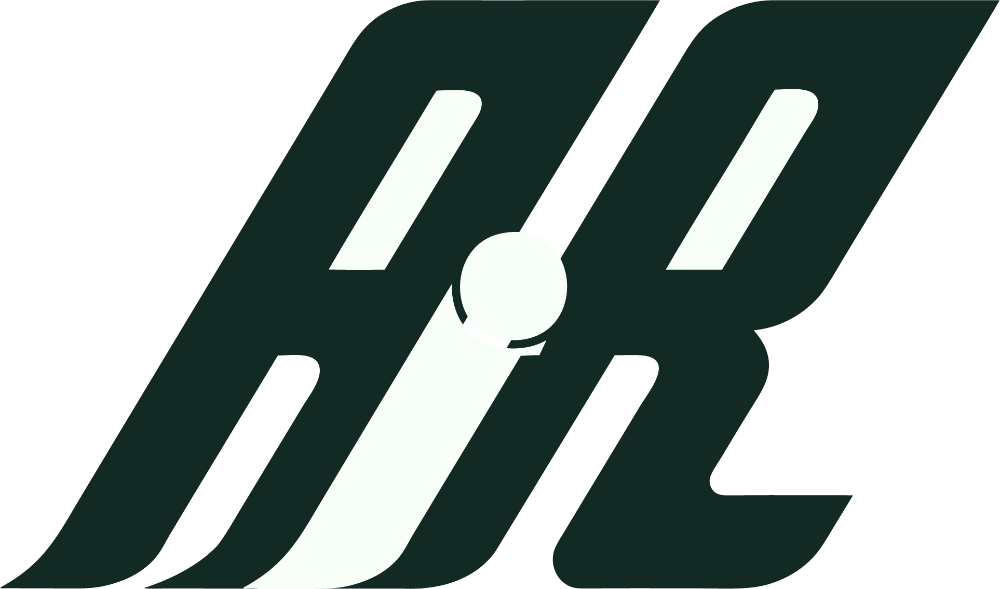

<p align="center"></p>

# AIR — AI Readiness

**A free community course by [Digi2U.org](https://digi2u.org). Ages 8–100. No cost, no
account, no tests, no certificates — you leave with something you actually made.**

> Clear the air. Un-clutter the mindset. Communicate with intention.

**▶ Live: https://borngifted.github.io/air/**

The landing page explains everything in plain words and offers two doors: a community
sign-in (first name, stored only on your device) and a facilitator entrance (session
code) that opens presenter mode.

## The experience

- **The mark is the interface** — the full-screen AIR logo is the home screen; its
  i-dot is a draggable playhead through the eight lessons; arrow keys, number keys and
  letterform click-zones all navigate.
- **🎥 HANDS** — turn on your webcam and *conduct* the deck: move your hand left–right
  and the dot follows (MediaPipe HandLandmarker, processed entirely in your browser,
  nothing uploaded).
- **Video atmosphere** — every act runs over footage from the course's own chained film:
  clutter → clearing → making → the world.
- **Practice suite** — Readiness Pulse, Task-Fit sorter, prompt brief builder,
  Review-the-Result signals, NIST-informed scenarios, and a private action plan. All
  answers save to your browser only.
- **🎙 AIR Radio** — a 16-minute Deep Dive podcast generated from the course sources.

## The eight lessons

| # | Lesson | The move |
|---|--------|----------|
| 1 | [Clear the Air](courses/lesson-01-clear-the-air.md) | From fear, hype and overload to one meaningful goal |
| 2 | [See the Possibility](courses/lesson-02-see-the-possibility.md) | What makes finished work useful |
| 3 | [Choose Your Mission](courses/lesson-03-choose-your-mission.md) | Person · problem · message · outcome |
| 4 | [Direct the Machine](courses/lesson-04-direct-the-machine.md) | Creative direction, not magic prompts |
| 5 | [Make It Clear](courses/lesson-05-make-it-clear.md) | Hierarchy, contrast, space |
| 6 | [Challenge the Result](courses/lesson-06-challenge-the-result.md) | Judgment is the work |
| 7 | [Build Your Way](courses/lesson-07-build-your-way.md) | Turn what worked into a repeatable workflow |
| 8 | [Put It in the World](courses/lesson-08-put-it-in-the-world.md) | Finish. Release. |

Every lesson offers three ways in — **Explore** (guided, great with kids), **Create**
(your own project), **Build** (under the hood) — never gated by age.

## Repository layout

```
index.html          landing page — plain-words breakdown + the two doors
present.html        the presentation: mark interface, HANDS, practice, portal
air-mark.js         playhead engine (drag / keys / click-zones / setPos hook)
air-hands.js        webcam hand-conducting (MediaPipe, local-only)
air-extras.js       practice widgets (localStorage) + section-video observer
courses/            the eight lessons, one file each
materials/          course map · full first lesson guide · brand book
marketing/          the five AIR commercial scripts + campaign overview
docs/               the film chain method (Seedance start→end-frame)
brand/              the AIR mark (SVG + PNG)
media/              the chained film, section scenes, posters
frames/             lesson anchor stills
```

## The method behind the film

The film running through the site was made with start→end-frame chaining: eight brand
stills generated in one visual world, then each motion clip conditioned to begin on the
exact final frame of the one before it. The first, seam-y attempt was kept on purpose —
spotting its drift *is* Lesson 6. Full recipe: [docs/film-chain-method.md](docs/film-chain-method.md).

## Brand

Deep green `#132a24` · ivory `#f7fff8` · bright green `#18C98B` · lime `#D8FF45`.
The mark — a forward-italic A + lowercase i + R, the i living in the negative space,
its dot the spark — drives every color, angle and motion on the site.
Details: [materials/air-brand-book.md](materials/air-brand-book.md).

---
Free community learning. Nothing sold, nothing collected.
Sponsored by **[Digi2U.org](https://digi2u.org)**.
